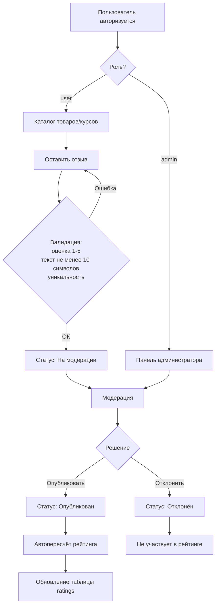

```mermaid
flowchart TD
    A["Пользователь авторизуется"] --> B{"Роль?"}
    B -->|user| C["Каталог товаров/курсов"]
    B -->|admin| D["Панель администратора"]
    C --> E["Оставить отзыв"]
    E --> F{"Валидация:<br/>оценка 1-5<br/>текст не менее 10 символов<br/>уникальность"}
    F -->|ОК| G["Статус: На модерации"]
    F -->|Ошибка| E
    G --> H["Модерация"]
    D --> H
    H --> I{"Решение"}
    I -->|Опубликовать| J["Статус: Опубликован"]
    I -->|Отклонить| K["Статус: Отклонён"]
    J --> L["Автопересчёт рейтинга"]
    K --> M["Не участвует в рейтинге"]
    L --> N["Обновление таблицы ratings"]
```
